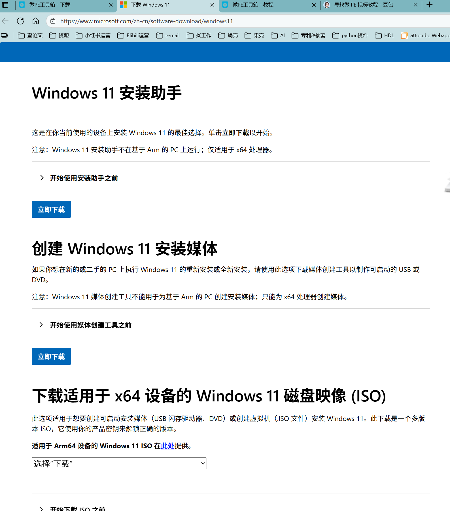
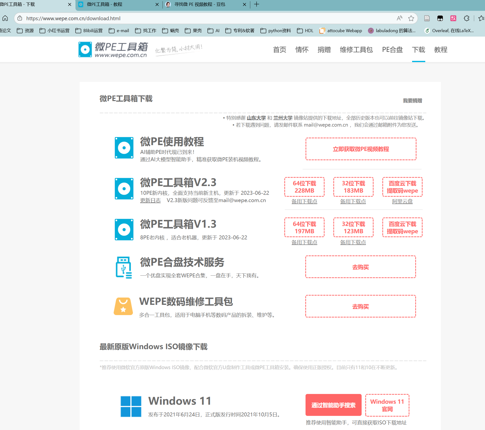

> **教程**     
> 本教程由luoyaocray编写，旨在帮助初学者快速重装系统。

## 1. 准备工作

准备一个内存不小于8G的U盘，用于制作启动盘。
鼠标右键点击U盘，选择格式化。
格式化时，选择文件系统为NTFS。
然后开始格式化，之后存放以下文件    

-------

下载windows11专业版镜像文件，可以从微软官网下载。      
https://www.microsoft.com/zh-cn/software-download/windows11       

选择下面的安装媒体，这一步就是下载镜像文件。    
下载以后解压在下载的电脑里，然后复制粘贴到U盘里即可。    

-------

https://www.wepe.com.cn/download.html    
下载pe工具箱，制作启动盘。    
       
选择微pe工具箱v2.3，64位下载     
如果下载速度慢，选择备用下载点       
下载在本地电脑里，然后用管理员身份运行。     
鼠标右击 “PE 工具箱 V2.3” 应用程序，    
选择 “以管理员身份运行”。       
在程序界面中，点击 “U 盘图标” 以安装 PE 到 U 盘。        
确认 U 盘卷标名称无误后，点击 “开始制作”。        
整个过程大约需要 3 分钟，完成后点击 “完成安装”。

------
## 2. 重装系统
重启电脑，并在开机画面出现后立刻按本机型的 U 盘启动快捷键，选择 U 盘启动以进入微 PE 系统。       

在微 PE 系统中，双击 “此电脑” 图标，鼠标右击 C 盘（或其他需要安装 Windows 11 的分区），选择 “格式化”，点击 “开始” 进行格式化，完成后点击 “确定”。       

双击启动桌面上的 “Windows 安装器” 图标。在选择 Windows 安装文件的位置处，点击 “搜索” 并选择 U 盘文件夹内的 Windows 11 镜像文件。根据磁盘类型选择正确的引导驱动器（MBR 或 GPT），然后选择 C 盘作为安装目标分区，点击 “确定” 后开始安装过程，此时可以拔掉 U 盘。        

安装完成后，重启电脑。在首次启动时，按照屏幕提示进行 Windows 11 的初始化设置，包括选择地区、输入法、接受许可协议、设置电脑名称和用户账户等。      
